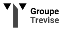

# Logo Groupe Trevise

> 
> 
>
> Regroupe Akema & Aprime

## Génération des logos

**Note:** Requiert `inkscape`.

    ./generate-logo.bash

Les logs sont générés dans `./png/`, en versions **couleurs**, **noir & blanc** et dans les tailles suivantes: `64px`, `128px`, `256px`, `512px`, `1024px`.

## Test

### Requirements

* [`bats`](https://github.com/sstephenson/bats) (Bash Automated Testing System).

### Run

    bats test/makefile.tests.bats
